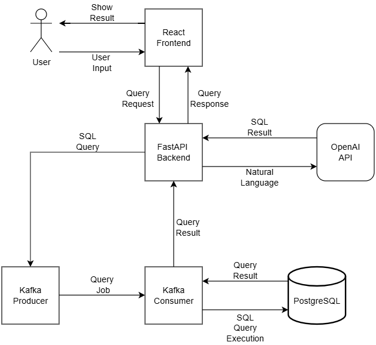

# 1. Introduction

## 1.1 Purpose
The purpose of this document is to define the software requirements for the "AI Powered Natural Language SQL Query Interface" project. This system enables users to input natural language questions and receive equivalent SQL queries, which are executed against a connected relational database. The goal is to simplify database access for non-technical users.

## 1.2 Scope
This project includes:
- A React-based frontend for user interaction
- A FastAPI backend that processes input and communicates with OpenAI
- A Kafka-based async pipeline to handle query generation and execution
- A SQL database that serves as the target for all queries

The system supports schema introspection, query formatting, error handling, and containerized deployment.

## 1.3 Technologies Used
- **Frontend**: React, TypeScript, Tailwind CSS
- **Backend**: FastAPI, Pydantic, OpenAI API
- **Async Processing**: Kafka (via Redpanda)
- **Database**: PostgreSQL (or compatible SQL DB)
- **Infrastructure**: Docker, Docker Compose, AWS EC2
- **Dev Tools**: GitHub Projects, Swagger, Postman

## 1.4 Definitions, Acronyms, Abbreviations
- **NL**: Natural Language
- **SQL**: Structured Query Language
- **API**: Application Programming Interface
- **UI**: User Interface
- **Kafka**: A distributed messaging system used for event streaming
- **OpenAI**: Cloud-based API for natural language processing
- **FastAPI**: Python web framework for building APIs quickly
- **EC2**: Amazon Elastic Compute Cloud (virtual servers)

<br/>
<br/>

# 2. Overall Description

## 2.1 Product Perspective
This system is a standalone web application that allows users to ask database-related questions in natural language. It transforms those questions into SQL queries using OpenAI, executes them against a SQL database, and displays the results in a user-friendly table.

The application follows a microservices-style architecture using Docker and Kafka for message passing and background processing. It is designed to be containerized and deployed to a cloud environment (e.g., AWS EC2).


## 2.2 Product Functions
At a high level, the system performs the following functions:

- **Frontend (React)**: 
  - Provides a form for natural language input
  - Displays query results in a formatted table
  - Handles loading states and error messages

- **Backend (FastAPI)**:
  - Accepts NL questions from the frontend
  - Sends the question to OpenAI API for SQL generation
  - Publishes the query to Kafka for async execution
  - Handles schema introspection and validation

- **Kafka**:
  - Connects backend to consumer
  - Decouples slow or complex SQL execution from frontend request cycle

- **Kafka Consumer**:
  - Listens for incoming SQL tasks
  - Executes queries against the database
  - Returns results to the backend

- **Database**:
  - Stores and serves data for querying
  - Provides schema metadata for introspection

- **OpenAI API**:
  - Converts natural language questions into SQL queries based on schema and prompt design

## 2.3 User Classes and Characteristics
- **Regular User**:
  - Accesses the web app via browser
  - Inputs questions in plain English (e.g., "Show me total sales this month")
  - Does not need any knowledge of SQL or database systems
  - Expects fast, readable, accurate results

> No admin or advanced user roles are defined in this version of the system.

## 2.4 Assumptions and Dependencies
- OpenAI API access and key are available and functional
- The SQL database is running and populated with accessible data
- All services (frontend, backend, Kafka, DB) are containerized via Docker
- Kafka is pre-configured and running (Redpanda is preferred for simplicity)
- The user has internet access and a modern browser
- Deployment target is an AWS EC2 instance with Docker installed

<br/>
<br/>

## 3. Functional Requirements

### 3.1 React Frontend
- Provide an input field for users to submit natural language questions.  
  ✅ *User can enter a question and click a "Submit" button.*

- Display query results in a user-friendly table format.  
  ✅ *When a valid question is submitted, results appear in a table.*

- Send requests to the FastAPI backend using HTTP.  
  ✅ *Requests are made via `POST /query` and receive JSON responses.*

- Handle error messages and loading states gracefully.  
  ✅ *On backend error or no results, appropriate user message is shown.*

- Ensure responsive design for desktop and mobile devices.  
  ✅ *Layout adjusts correctly on different screen sizes (tested via dev tools).*

---

### 3.2 FastAPI Backend
- Receive questions from the frontend via POST `/query` endpoint.  
  ✅ *Receives JSON payload with a question and responds within 2 seconds.*

- Forward the natural language question to the OpenAI API.  
  ✅ *Backend logs include a call to OpenAI for each new question.*

- Send the generated SQL query to Kafka Producer.  
  ✅ *Kafka topic receives a message with a valid SQL string.*

- Receive query results from Kafka Consumer and return them to the frontend.  
  ✅ *API response includes the executed query results in JSON.*

- Provide logging and error handling for all operations.  
  ✅ *All key events and errors are logged and can be verified.*

---

### 3.3 OpenAI API Integration
- Accept natural language questions via FastAPI backend.  
  ✅ *Request sent to OpenAI includes the original user question.*

- Generate SQL queries using a fine-tuned or prompt-based OpenAI model.  
  ✅ *Response from OpenAI includes a syntactically valid SQL query.*

- Return the SQL query back to the backend for further processing.  
  ✅ *SQL is included in the backend logs or internal flow.*

- Handle token limits and rate limiting gracefully.  
  ✅ *If OpenAI quota is exceeded, user receives a friendly error message.*

---

### 3.4 Kafka Producer & Consumer
- **Producer:** Publish SQL queries received from the backend to a Kafka topic.  
  ✅ *Kafka topic contains one message per incoming query.*

- **Consumer:** Listen for new queries on the topic and execute them.  
  ✅ *Consumer executes each message's SQL query against the DB.*

- Return the query results to the backend after execution.  
  ✅ *Result is passed back via Kafka or DB and appears in the frontend.*

- Ensure fault-tolerant message handling and support retries.  
  ✅ *Failed messages are retried and logged without data loss.*

---

### 3.5 Database Access
- Store structured business data in PostgreSQL.  
  ✅ *Database schema includes relevant tables and test data.*

- Allow read-only access via SQL queries executed by Kafka Consumer.  
  ✅ *Write attempts (e.g. INSERT, DELETE) are rejected or blocked.*

- Prevent dangerous or destructive SQL operations.  
  ✅ *Input validation or prompt tuning avoids DROP/ALTER commands.*

- Optimize common queries for performance.  
  ✅ *Frequent queries complete within 1 second under normal load.*

<br/>
<br/>

## 4. Non-Functional Requirements

### 4.1 Performance
- The system should return query results within **3 seconds** for 95% of requests under normal load.  
  ✅ *Measure using API response time logs and load testing tools like Locust or Postman runner.*

- The frontend should load within **1.5 seconds** on a standard broadband connection.  
  ✅ *Test with browser dev tools (Lighthouse or Chrome DevTools).*

- OpenAI API calls should be asynchronously handled to avoid blocking UI responsiveness.  
  ✅ *Test that the UI remains responsive during API calls using manual testing or animation markers.*

---

### 4.2 Reliability & Availability
- The system should be available **99% of the time**, excluding scheduled maintenance.  
  ✅ *Track uptime using a monitoring tool (e.g., UptimeRobot, Pingdom, or healthcheck endpoint).*

- In case of Kafka or database downtime, the system should queue requests and retry automatically.  
  ✅ *Simulate a service outage and verify that jobs are retried without data loss.*

- Errors should be logged and alert the developer via console or monitoring tools.  
  ✅ *Inject an error and verify that logs appear and alerts are triggered (or visible in logs).*

---

### 4.3 Scalability
- The architecture must support **horizontal scaling** of Kafka consumers and backend services.  
  ✅ *Spin up multiple Kafka consumers and verify message load balancing.*

- OpenAI API usage should support concurrent requests from multiple users.  
  ✅ *Run parallel requests from multiple users and verify response times and stability.*

- PostgreSQL should be configured to handle growing datasets without performance degradation.  
  ✅ *Test with synthetic data (e.g., 1M+ rows) and monitor query latency.*

---

### 4.4 Security
- All communication between frontend and backend must be secured via **HTTPS**.  
  ✅ *Check network traffic using browser dev tools — all requests must use HTTPS.*

- User inputs should be sanitized to prevent **SQL injection** or prompt injection attacks.  
  ✅ *Use test payloads like `' OR 1=1--` and observe safe rejection or neutralization.*

- API keys (e.g., OpenAI) must be stored securely in environment variables or secret managers.  
  ✅ *Confirm that `.env` files or secure CI/CD secrets are used, and keys are not hardcoded.*

- Unauthorized access to internal services (Kafka, DB) must be restricted.  
  ✅ *Attempt unauthorized access using test credentials or restricted ports — expect access denial.*

---

### 4.5 Maintainability & Portability
- The entire system must be containerized with **Docker**, making it easy to deploy and update.  
  ✅ *Run `docker-compose up` and verify all services launch and communicate.*

- Source code should follow clear **modular design patterns** with appropriate documentation.  
  ✅ *Code review confirms separation of concerns and inline documentation is present.*

- The project should run in any environment that supports Docker and Python 3.10+.  
  ✅ *Clone the repo on a clean machine and run with minimal setup.*

- The codebase must be hosted on GitHub with issue tracking and CI/CD pipeline support.  
  ✅ *Verify the presence of GitHub workflows and an organized project board.*

<br/>
<br/>

## 5. System Architecture

### 5.1 Architecture Diagram

The diagram below illustrates the interaction between the major components of the system:



The system follows a modular, loosely-coupled architecture that separates the frontend, backend, asynchronous processing, and external services using containers and Kafka for decoupled communication.

---

### 5.2 Component Overview

#### 🔹 React Frontend
- Collects natural language input from the user.
- Sends a request to the backend via HTTP.
- Displays formatted query results in a table.
- Handles errors and loading states.

#### 🔹 FastAPI Backend
- Receives questions via the `/query` endpoint.
- Forwards the question to the OpenAI API for SQL generation.
- Sends the resulting SQL to Kafka for execution.
- Receives query results from Kafka and returns them to the frontend.

#### 🔹 OpenAI API
- Converts natural language questions into SQL queries based on a defined prompt.
- Interacts only with the backend, not directly with the user.

#### 🔹 Kafka Producer
- Publishes SQL queries to a Kafka topic asynchronously.
- Decouples user requests from query execution.

#### 🔹 Kafka Consumer
- Listens for new SQL queries on the Kafka topic.
- Executes them against the database.
- Sends results back to the backend.

#### 🔹 PostgreSQL Database
- Stores structured business data.
- Responds to read-only SQL queries executed by the Kafka consumer.
- Does not allow write or destructive operations.

<br/>
<br/>

## 6. External Interfaces

### 6.1 User Interface (UI/UX Expectations)

- The user interacts through a clean, minimal React-based web app.
- A single input field accepts natural-language questions.
- A **Submit** button triggers the query process.
- Results are displayed in a scrollable, responsive table.
- Loading indicators and clear error messages are shown when applicable.
- Design is responsive for both desktop and mobile devices.

---

### 6.2 API Interface (OpenAPI Endpoints)

**POST** `/query`

- **Description**: Receives a natural language question and returns the corresponding SQL query result.

- **Request Body** (JSON):
  ```json
  {
    "question": "Show me the total number of orders this week"
  }

- **Response** (JSON):
  ```json
  {
    "results": [
        { "date": "2025-07-01", "orders": 42 },
        { "date": "2025-07-02", "orders": 37 }
    ]
  }

- **Errors**:
    - `400 Bad Request`: Invalid or missing input
    - `500 Internal Server Error`: Downstream service failure (OpenAI, DB, etc.)

- **OpenAPI (Swagger)** documentation is exposed via `/docs`

<br/>

**GET** `/schema`

- **Description**: Returns the current structure of the PostgreSQL database (table names, columns, data types).

- **Response** (JSON):
  ```json
  {
    "tables": [
        {
            "name": "orders",
            "columns": [
                { "name": "id", "type": "integer" },
                { "name": "date", "type": "date" },
                { "name": "amount", "type": "float" }
            ]
        },
        {
            "name": "customers",
            "columns": [
                { "name": "id", "type": "integer" },
                { "name": "name", "type": "text" },
                { "name": "email", "type": "text" }
            ]
        }
    ]
  }


- **Errors**:
    - `500 Internal Server Error`: Unable to retrieve schema

- **OpenAPI (Swagger)** documentation is exposed via `/docs`

---

### 6.3 Database Interface

- Backend uses **SQLAlchemy** to interface with a PostgreSQL database.

- The system only performs **read-only queries**.

- Schema introspection is supported (optional) via:
  - A `/schema` endpoint (if implemented), or
  - Internal SQL queries like:
    ```sql
    SELECT * FROM information_schema.columns
    WHERE table_schema = 'public';
    ```

- Query results are returned as JSON objects from the database and passed back to the FastAPI backend for delivery to the user interface.

---

### 6.4 Messaging Interface (Kafka)

- The system uses **Kafka** for asynchronous handling of SQL queries.

#### Kafka Producer
- The FastAPI backend acts as a producer.
- Publishes messages to a Kafka topic (e.g., `nl-sql-queries`).
- Message structure:
  ```json
  {
    "query_id": "abc123",
    "sql": "SELECT COUNT(*) FROM orders WHERE date >= CURRENT_DATE - INTERVAL '7 days'"
  }

#### Kafka Consumer
- A separate Python service acts as the consumer.
- Subscribes to the same Kafka topic.
- Executes the SQL query against the PostgreSQL database.
- Sends the result back to the backend (e.g., via REST callback or another message channel).
- Kafka is expected to run locally using Docker (e.g., Redpanda) or be hosted on a managed service.